  
  

  <h1>Sharfuddin Shawon</h1>

  <a href="https://shawon.me">Portfolio</a> · <a href="https://linkedin.com/in/sharf-shawon">LinkedIn</a> · <a href="mailto:sharf.shawon@gmail.com">Email</a>

Full-Stack Software Engineer and DevOps Practitioner focused on shipping precise, production-grade applications. Based in the United States, I build end-to-end systems that bridge the gap between robust backend architecture and high-performance frontend interfaces.

---

  

### **Stack Kernel**

#### **Language**  

 

#### **ML/DL**

#### **Database**

#### **Frontend**  

#### **Backend**  

#### **DevOps & Infrastructure**  

#### **Operating Systems**

---

### **Featured Projects**

#### **Porichoy.Cards**
- **Problem**: Physical business cards are static, wasteful, and impossible to update.
- **Solution**: A digital business card platform replacing physical cards with programmable profiles accessible via NFC and QR technology.
- **Stack**: `Django` `React` `PostgreSQL` `Docker`
- **Outcome**: Shipped a commercial-grade product enabling real-time profile management and instant networking.
- **Links**: [Live Demo](https://porichoy.cards) · [GitHub Repo](#)

#### **Hybrid Homelab**
- **Problem**: Production-grade distributed infrastructure typically requires high cloud costs or enterprise hardware.
- **Solution**: A 6-node geographically distributed infrastructure running on multi-vendor hardware (HP EliteDesk, Dell Wyse, thin clients) with end-to-end encrypted virtual overlay networks.
- **Stack**: `Proxmox VE` `Kubernetes` `Docker` `Tailscale/Overlay` `Nginx Proxy Manager`
- **Outcome**: 98% uptime and 43% power reduction across a production-grade DevOps environment.
- **Links**: [Infrastructure Brief](#)

#### **Project Rokto**
- **Problem**: Fragmented blood donation systems in Bangladesh cause life-threatening delays.
- **Solution**: A non-profit, open-source centralized platform connecting donors with recipients in real-time.
- **Stack**: `React` `Node.js` `PostgreSQL` `Open-Source`
- **Outcome**: (In Progress) Building a scalable infrastructure for emergency blood supply management.
- **Links**: [GitHub Repo](https://github.com/sharf-shawon/project_rokto)

---

### **Currently**
Building **Porichoy.Cards** and **Project Rokto**. Maintaining a geographically distributed **Hybrid Homelab** (6 nodes, 98% uptime).

### **Open to**
Professional software engineering roles focused on Full-Stack development and DevOps infrastructure. Open to recruiter DMs.

---

