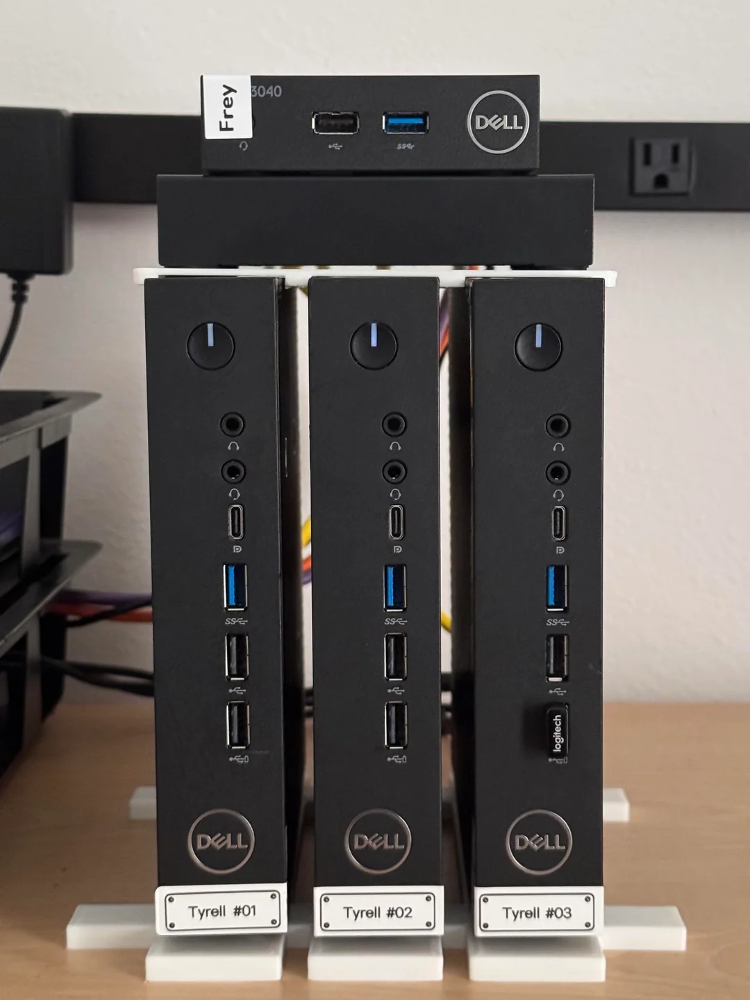
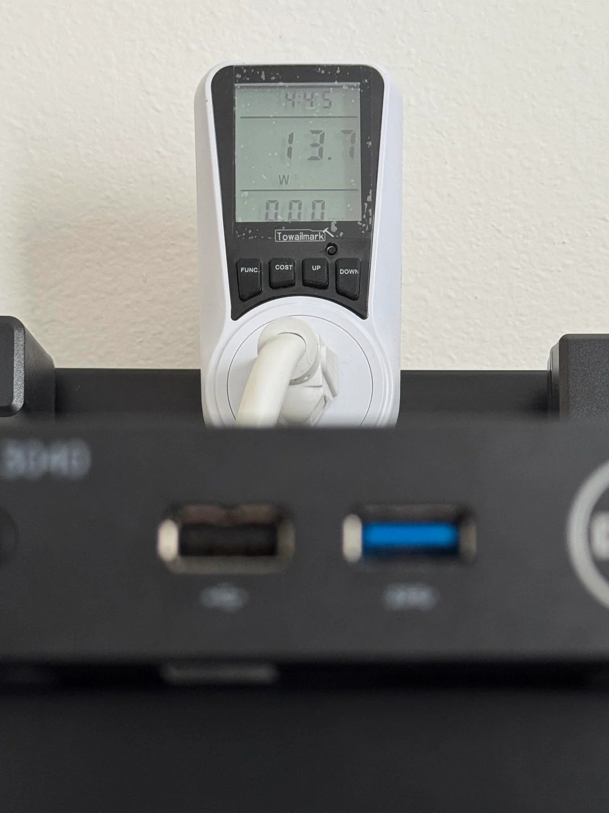
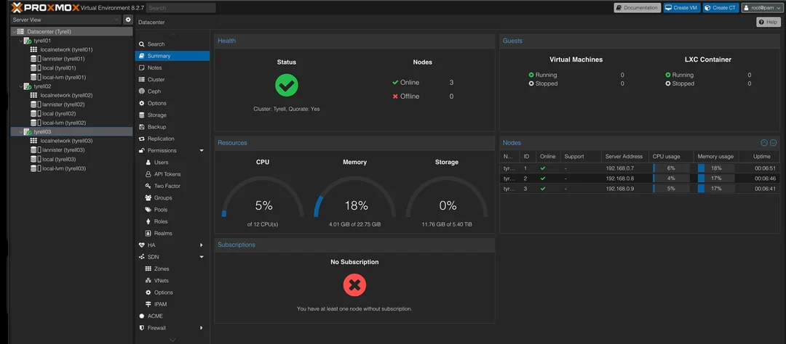

# Can You Run a Proxmox VE HA Cluster on Dell Wyse 5070? Real-World Insights

Is the Dell Wyse 5070 a viable choice for running a **Proxmox VE High Availability (HA) Cluster** in your homelab? This comprehensive review explores the real-world capabilities and limitations of deploying a Proxmox HA cluster on Dell Wyse 5070 thin clients, with a focus on storage, networking, and overall performance. If you're searching for a **low-power, cost-effective server solution**, read on for practical insights and SEO-optimized recommendations.

---

## Dell Wyse 5070 Overview: Low Power, High Potential?

The **Dell Wyse 5070**, powered by Intel J4105 or J5005 processors, is popular among homelab enthusiasts for its affordability and energy efficiency. Many users consider it for lightweight virtualization, container orchestration, and always-on services. But does it have what it takes to support a true **Proxmox VE HA Cluster**?

  
---

## Storage Limitations: eMMC and SATA Constraints

### eMMC Storage

The built-in **eMMC storage** on the Wyse 5070 is not recognized by the Proxmox VE GUI by default. While it is possible to install Proxmox VE on eMMC using command-line workarounds, this storage medium is not designed for the high I/O and reliability demands of HA clusters. eMMC is prone to wear and is not recommended for critical or persistent storage in production or enthusiast HA environments.

### SATA Support

Each Wyse 5070 provides only a **single SATA port**, allowing for just one M.2 SSD. This limitation makes it impossible to configure OSD required for Proxmox HA and/or Ceph setups. While external USB drives can be added, they are not ideal for performance or reliability in clustered environments.

The Dell Wyse 5070 does not offer the storage flexibility or reliability required for a Proxmox VE HA Cluster. Avoid using eMMC for critical storage, and note the lack of dual-disk support.

---

## Networking: Expandability Required for HA and Ceph

My Dell Wyse 5070 features:

- 1x Gigabit Ethernet port
- Wi-Fi (5GHz), which is not recommended for clustering or storage traffic

  

For Proxmox HA or Ceph clusters, dedicated and redundant networking is essential. The single onboard Ethernet port is insufficient for separating cluster, storage, and management traffic. Because, a single shared link can cause congestion and result in poor throughput. Specially, since we can't use high speed nvme storage. However, networking can be expanded via:

- **USB Ethernet adapters**
- **M.2 A+E slot** for an additional NIC (i.e. Realtek RTL8125B NIC, ensure compatibility)
- **VLAN-capable switches** for traffic segmentation

Serious HA or Ceph workloads require at least one additional Ethernet interface per node. The default networking (single 1Gbps) is inadequate for high-availability clustering.

---

## Power Efficiency vs. Performance

The Wyse 5070 excels in **power efficiency**, with a TDP under 10W. This makes it ideal for:

- Always-on lightweight services
- Learning environments
- Running a handful of virtual machines or containers

  

However, the **Intel J4105/J5005 CPUs** and limited RAM (officially up to 8GB, though some users report success with 32GB) are not suitable for compute-intensive or high IOPS workloads, such as those required by Ceph or enterprise-grade HA clusters.

The Wyse 5070 is best suited for light homelab tasks, not for demanding high-availability or storage-intensive applications.

---

## Summary Table: Dell Wyse 5070 for Proxmox VE HA Cluster

| Criteria                 | Dell Wyse 5070 Capability         |
|--------------------------|-----------------------------------|
| Dual Disk Support        | ❌ Not available                   |
| Reliable Local Storage   | ❌ eMMC not suitable               |
| Dual NICs                | ❌ Only one onboard Ethernet       |
| Ceph Ready               | ❌ Requires additional NICs        |
| Power Efficiency         | ✅ Excellent                       |
| General Usability        | ✅ Good for lightweight workloads  |

> **Proxmox VE HA Cluster is not practical on the Wyse 5070 without significant hardware modifications.** For Ceph, a dedicated Ethernet interface per node is essential, and the cost of required upgrades often exceeds the value of the thin clients themselves.

---

## Alternative Use Cases for Dell Wyse 5070 in a Homelab

If you already own Dell Wyse 5070 units, consider these practical applications:

- Standalone Proxmox VE node for basic virtualization
- Proxmox Cluster w/o HA with NAS storage (My setup)
- Proxmox Backup server or other backup/replication node
- Docker Swarm or lightweight Kubernetes (K3s) node
- Home Assistant, Pi-hole and/or VaultWarden server
- NFS/SMB client for shared storage environments

---

## Final Thoughts: Is the Wyse 5070 Right for Your Proxmox Homelab?

The **Dell Wyse 5070** offers outstanding value for power-conscious homelabbers seeking a low-power Proxmox server. However, it falls short for High Availability Cluster deployments due to its storage and networking limitations. While you can technically configure a cluster with external storage and additional NICs, the total cost and complexity outweigh the benefits.

**For true high availability, look for nodes with:**

- Dual SATA/NVMe support
- Dual NICs
- Higher IOPS storage options
- ECC memory (if possible)

If your goal is a reliable, scalable Proxmox VE HA Cluster, consider investing in hardware designed for clustering and redundancy. For budget-conscious homelabs, HP Elitedesk Mini offer better value with dual disk support and more flexible networking options.

---

## Next Steps

Curious about using the Wyse 5070 for a low-power Kubernetes (K3s) cluster? Stay tuned for upcoming posts exploring this use case in detail.

**Got questions or suggestions? Drop a comment below or [contact me here](/contact).**
