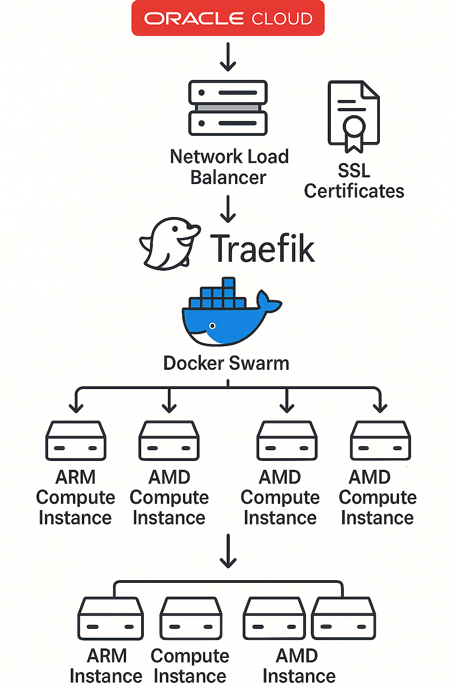
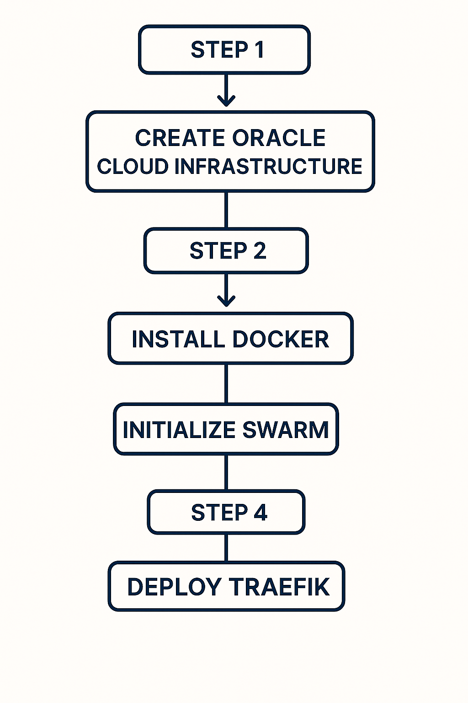
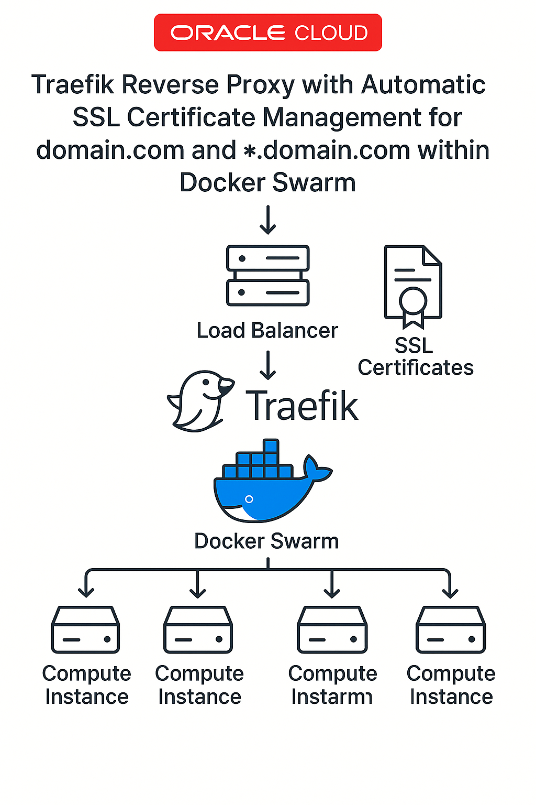

## Introduction

Oracle Cloud Infrastructure offers one of the most generous always-free tier programs among cloud providers. With proper configuration, you can build enterprise-grade infrastructure completely within the free tier limits. In this guide, I'll walk you through creating a high-availability Docker Swarm cluster using a mix of ARM and AMD instances, complete with automatic SSL certificate management via Traefik and a robust network load balancer setup.

This approach maximizes the available Oracle Cloud Free Tier resources to create a production-ready container orchestration platform that would otherwise cost significant money on other cloud providers.



## Oracle Cloud Free Tier Resources

Before diving into the implementation, let's understand what resources we have available in the Oracle Cloud Always Free tier:

- **ARM-based Ampere A1 Compute**: 4 OCPUs and 24GB RAM total
- **AMD-based Virtual Machines**: 2 VM.Standard.E2.1.Micro instances (1 OCPU, 1GB RAM each)
- **Block Storage**: 200GB total (across all boot volumes)
- **Object Storage**: 20GB
- **Network Load Balancer**: 1 instance (10Mbps)

Our architecture will utilize:
- 2 ARM instances with 2 OCPUs and 12GB RAM each (100% of available ARM resources)
- 2 AMD instances with 1 OCPU and 1GB RAM each (100% of available AMD instances)
- Network Load Balancer for high availability

## Step 1: Infrastructure Setup

### Create Virtual Cloud Network

First, let's create the network infrastructure:

1. Navigate to **Networking** > **Virtual Cloud Networks** > **Create VCN** in the Oracle Cloud console
2. Create a VCN named "docker-swarm-vcn" with CIDR block 10.0.0.0/16
3. Add a regional subnet named "docker-swarm-subnet" with CIDR 10.0.1.0/24
4. Create an Internet Gateway named "docker-swarm-igw"
5. Update the default route table with destination 0.0.0.0/0 pointing to the Internet Gateway

### Configure Security Rules

Configure the security list to allow necessary traffic:

```bash
# Required ports for Docker Swarm operation
SSH (22/TCP)
HTTP (80/TCP)
HTTPS (443/TCP)
Docker Swarm management (2377/TCP)
Node communication (7946/TCP and UDP)
Overlay networking (4789/UDP)
```

## Step 2: Create Compute Instances

### ARM Ampere A1 Instances

Create two ARM instances for maximum computing power:

```bash
# Manager Node
Name: swarm-manager-arm
Shape: VM.Standard.A1.Flex
OCPUs: 2
Memory: 12GB
OS: Ubuntu 22.04

# Worker Node 1
Name: swarm-worker-arm
Shape: VM.Standard.A1.Flex
OCPUs: 2
Memory: 12GB
OS: Ubuntu 22.04
```

### AMD Micro Instances

Create two AMD instances for additional workers:

```bash
# Worker Node 2
Name: swarm-worker-amd-1
Shape: VM.Standard.E2.1.Micro
OS: Ubuntu 22.04

# Worker Node 3
Name: swarm-worker-amd-2
Shape: VM.Standard.E2.1.Micro
OS: Ubuntu 22.04
```



## Step 3: Docker Installation and Configuration

### Install Docker on All Nodes

Connect to each instance via SSH and execute:

```bash
# Update system packages
sudo apt update && sudo apt upgrade -y

# Install Docker using the convenience script
curl -fsSL https://get.docker.com -o get-docker.sh
sudo sh get-docker.sh

# Add user to docker group
sudo usermod -aG docker $USER

# Enable and start Docker service
sudo systemctl enable docker
sudo systemctl start docker
```

### Configure Oracle Cloud Networking

Oracle Cloud instances require specific iptables configuration:

```bash
# Fix Oracle Cloud firewall issues
sudo iptables -I INPUT -j ACCEPT
sudo iptables -I INPUT -p tcp --dport 2377 -j ACCEPT
sudo iptables -I INPUT -p tcp --dport 7946 -j ACCEPT
sudo iptables -I INPUT -p udp --dport 7946 -j ACCEPT
sudo iptables -I INPUT -p udp --dport 4789 -j ACCEPT
sudo iptables -I INPUT -p tcp --dport 80 -j ACCEPT
sudo iptables -I INPUT -p tcp --dport 443 -j ACCEPT

# Make iptables rules persistent
sudo apt-get install -y iptables-persistent
sudo netfilter-persistent save
```

## Step 4: Docker Swarm Initialization

### Initialize Swarm Manager

On the swarm-manager-arm instance:

```bash
# Get private IP address
PRIVATE_IP=$(hostname -I | awk '{print $1}')
echo "Manager Private IP: $PRIVATE_IP"

# Initialize Docker Swarm
docker swarm init --advertise-addr $PRIVATE_IP

# Generate and save worker join token
docker swarm join-token worker
```

### Join Worker Nodes

Execute the join command on each worker node:

```bash
# On swarm-worker-arm, swarm-worker-amd-1, and swarm-worker-amd-2
docker swarm join --token SWMTKN-1-xxx <MANAGER_PRIVATE_IP>:2377
```

Verify cluster formation:

```bash
# On manager node
docker node ls
```

## Step 5: Traefik Deployment with SSL

Traefik will serve as our reverse proxy and handle automatic SSL certificate management.



### Create Traefik Network and Configuration

Create the overlay network for Traefik on the manager node:

```bash
docker network create --driver=overlay --attachable traefik-public
```

Create Traefik configuration directory and files:

```bash
mkdir -p /opt/traefik
```

Create the Traefik configuration file:

```yaml
# /opt/traefik/traefik.yml
global:
  checkNewVersion: false
  sendAnonymousUsage: false

api:
  dashboard: true

entrypoints:
  web:
    address: ":80"
    http:
      redirections:
        entrypoint:
          to: websecure
          scheme: https
  websecure:
    address: ":443"

providers:
  swarm:
    endpoint: "unix:///var/run/docker.sock"
    exposedByDefault: false
    network: traefik-public

certificatesResolvers:
  letsencrypt:
    acme:
      email: your-email@domain.com
      storage: /letsencrypt/acme.json
      dnsChallenge:
        provider: cloudflare
        delayBeforeCheck: 0
```

### Deploy Traefik Stack

Create the Docker Compose file for Traefik deployment:

```yaml
# /opt/traefik/docker-compose.yml
version: '3.8'

services:
  traefik:
    image: traefik:v3.1
    ports:
      - "80:80"
      - "443:443"
    volumes:
      - /var/run/docker.sock:/var/run/docker.sock:ro
      - /opt/traefik/traefik.yml:/etc/traefik/traefik.yml:ro
      - traefik-certificates:/letsencrypt
    environment:
      - CF_API_EMAIL=your-email@domain.com
      - CF_API_KEY=your-cloudflare-api-key
    networks:
      - traefik-public
    deploy:
      placement:
        constraints:
          - node.role == manager
      labels:
        - "traefik.enable=true"
        - "traefik.http.routers.dashboard.rule=Host(`traefik.domain.com`)"
        - "traefik.http.routers.dashboard.tls.certresolver=letsencrypt"
        - "traefik.http.routers.dashboard.tls.domains[0].main=domain.com"
        - "traefik.http.routers.dashboard.tls.domains[0].sans=*.domain.com"
        - "traefik.http.routers.dashboard.service=api@internal"

volumes:
  traefik-certificates:

networks:
  traefik-public:
    external: true
```

Deploy the Traefik stack:

```bash
cd /opt/traefik
docker stack deploy -c docker-compose.yml traefik
```

## Step 6: Network Load Balancer Configuration

### Create Load Balancer

1. Navigate to **Networking** > **Load Balancers** > **Create Load Balancer** in the Oracle Cloud console
2. Select **Network Load Balancer** and configure it as public with a reserved IP address
3. Choose the docker-swarm-vcn and docker-swarm-subnet created earlier

### Configure Backend Sets and Listeners

1. Create a backend set named "docker-swarm-backends" with HTTP health checks on port 80
2. Add all four compute instances as backends on port 80
3. Configure two listeners: one for HTTP (port 80) and one for HTTPS (port 443), both pointing to the backend set

## Step 7: DNS Configuration and Testing

### Point Domain to Load Balancer

Create DNS A records pointing both your domain and wildcard subdomain to the Network Load Balancer's public IP address:

```
domain.com → Load Balancer IP
*.domain.com → Load Balancer IP
```

### Deploy Sample Application

Test the setup with a sample application:

```yaml
# /opt/sample-app.yml
version: '3.8'

services:
  whoami:
    image: traefik/whoami
    networks:
      - traefik-public
    deploy:
      replicas: 2
      labels:
        - "traefik.enable=true"
        - "traefik.http.routers.whoami.rule=Host(`app.domain.com`)"
        - "traefik.http.routers.whoami.tls.certresolver=letsencrypt"

networks:
  traefik-public:
    external: true
```

Deploy the sample application:

```bash
docker stack deploy -c /opt/sample-app.yml sample-app
```

## Verification and Troubleshooting

### Verify Cluster Status

Check the Docker Swarm cluster health:

```bash
# On manager node
docker node ls
docker service ls
docker stack ls
```

### Test SSL Certificates

Verify automatic SSL certificate generation:

```bash
# Test certificate validity
openssl s_client -connect domain.com:443 -servername app.domain.com
```

### Common Issues

- **Docker Swarm join failures**: Check iptables configuration or security group settings
- **Service accessibility issues**: Verify Traefik labels or network configuration
- **SSL certificate problems**: Check DNS provider credentials or domain verification

## Conclusion

By following this guide, you've created a high-availability Docker Swarm cluster running entirely within Oracle Cloud's Always Free Tier resources. This setup provides enterprise-grade container orchestration with automatic SSL certificate management at zero cost.

The combination of ARM and AMD instances maximizes available compute resources, while the Network Load Balancer and Traefik ensure high availability and secure access to your services. This foundation allows you to deploy and scale containerized applications with confidence, all without incurring any cloud costs.

Feel free to build upon this infrastructure by adding monitoring, logging, and CI/CD pipelines to create a complete DevOps platform on Oracle Cloud's free tier resources.