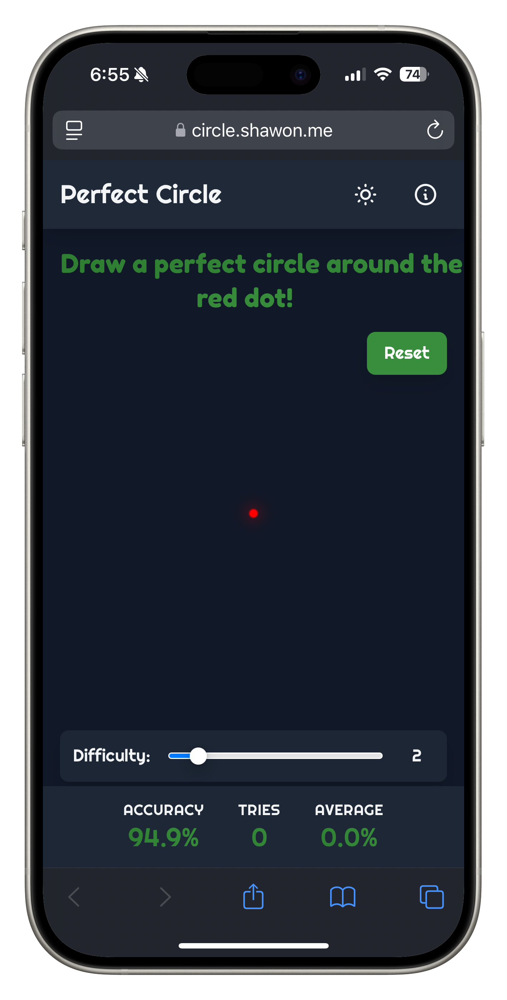

# Perfect Circle Game: A Fun Challenge for Precision and Accuracy

## Introduction

Ever wondered how steady your hand is? **Perfect Circle Game** challenges you to draw the most accurate circle possible while measuring your precision in real time.  

Built with **vanilla JavaScript, HTML5 Canvas, and Tailwind CSS**, the game is fully client-side, lightweight, and deployable via **Docker & Nginx Alpine**.  


## 🚀 Live Game and Source Code

- 🔗 [Play Perfect Circle Game](https://circle.shawon.me)
- 🗂️ [GitHub Repository](https://github.com/sharf-shawon/circle-game)  


## 🕹️ Features  

- **Real-time accuracy calculation**  
- **Adjustable difficulty levels**  
- **Dark mode support**  
- **Stats tracking** (attempts & average accuracy)  
- **Responsive design** for desktop & mobile  


## 🚀 Quick Setup  

### 🔥 Run with Docker (Recommended)  

```bash
git clone https://github.com/sharf-shawon/circle-game.git
cd circle-game
docker-compose up -d
```

The game will be available at http://localhost:8687.




### Manual Deployment

Just open index.html in your browser—no dependencies needed!

## 🛠️ Tech Stack
Frontend: Vanilla JS, HTML5 Canvas, Tailwind CSS
Deployment: Nginx Alpine, Docker, Docker Compose
No Backend Required: Fully client-side

## 🔥 Challenges & Learnings
Implementing real-time accuracy calculation using geometry
Optimizing HTML5 Canvas performance for smooth drawing
Seamless deployment with Docker & Nginx Alpine

## 🎯 Why I Built This
A mix of fun and technical challenge, this project sharpened my skills in frontend development, optimization, and containerization. Plus, it’s a great way to test hand-eye coordination!