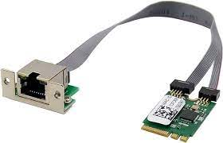

  

🔗 **HP T630 Info:** [Parky Towers](https://www.parkytowers.me.uk/thin/hp/t630/)  

## Why the HP T630?  

- **Cost-Effective:** Purchased for **$14.99 on eBay**.  
- **Low Power Consumption:** **12W idle, 28W max** with **passive cooling**.  
- **AES-NI Support:** Ideal for **pfSense** performance.  
- **Compact & Silent:** Small form factor, no fan noise.  
- **Upgradeable:** Supports **2.5Gb LAN** via M.2 NIC.  

## 🔌 Choosing & Installing the NIC  

The **HP T630 lacks PCIe**, but it has an **M.2 2230 slot** (typically for WiFi). The best fit:  

- **Realtek RTL8125B 2.5Gb NIC** ✅  
  - Confirmed **compatible** ([Source](https://www.miccet.nl/2023/01/11/extra-nic-on-the-hp-thin-client-t630/)).  
  - Purchased for **$7 on AliExpress** ([Link](https://www.aliexpress.us/item/3256804497025928.html)).  

### 🔧 NIC Installation  

1. Removed the **detachable VGA port**.  
2. Installed the **Realtek RTL8125B NIC** in the **M.2 2230 slot**.  
3. **WAN:** Integrated 1Gb Ethernet, **LAN:** 2.5Gb NIC.  

  

## 🖥️ Installing pfSense  

1. Download **[pfSense](https://www.pfsense.org/download/)** & write to USB using **[Etcher](https://etcher.balena.io/)**.  
2. Boot from USB and install pfSense.  
3. **Issue:** Realtek NIC not detected initially.  

### 🔹 Fixing Realtek NIC Detection  

1. Complete initial setup using **only the 1Gb NIC**.  
2. Access **pfSense console (option 8: Shell)**.  
3. Install the Realtek driver:  

   ```sh
   pkg add net/realtek-re-kmod
   ```  

4. Enable the driver on boot by editing `/boot/loader.conf`:  

   ```sh
   if_re_load="YES"
   if_re_name="/boot/modules/if_re.ko"
   ```  

5. **Reboot** and reassign network interfaces (**option 1** in the console menu).  

  

## ✅ Final Thoughts  

With pfSense running on an **HP T630 + 2.5Gb NIC**, I now have a **power-efficient, silent, and cost-effective router**. This setup supports **network segmentation** via a **managed 2.5Gb switch**, ensuring optimal performance for **home, guest, and IoT devices**.  

🚀 **Total cost: Under $25** for a **high-performance pfSense firewall**!  

---  

💡 **Need a budget-friendly router for your homelab?** The **HP T630 + pfSense** is an excellent choice!  
