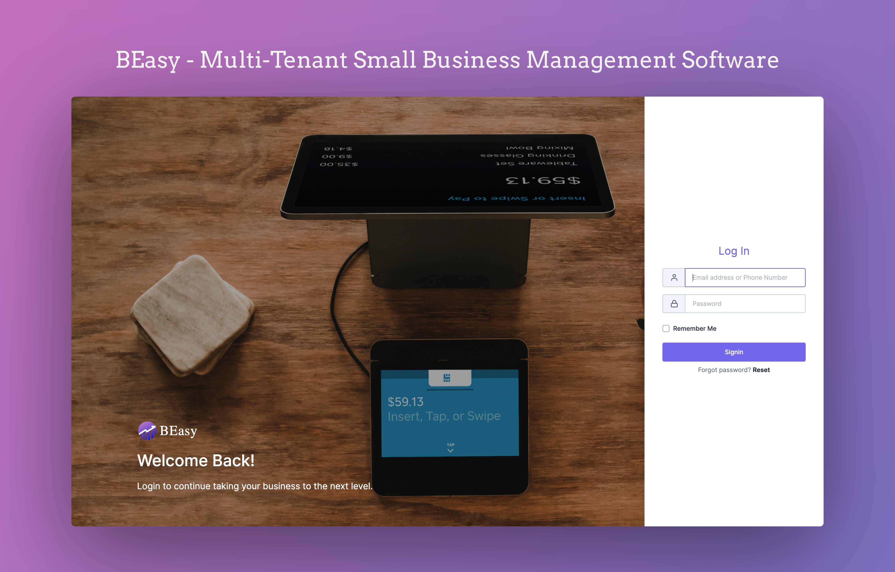

### Overview

**BEasy** is a comprehensive small business management solution developed in 2022 to streamline operations for small business owners. Built in support of a friend's new business venture, this cloud-ready SaaS application leverages a modern tech stack—**Laravel** for backend development, **Bootstrap** for responsive UI design, and **MySQL** for robust data management. With its multi-tenant architecture, BEasy efficiently provisions a dedicated environment for each new small business through a simple account creation process.

### Live Demo 
- Try out [BEasy Live Demo](https://beasy.shawon.me).

```yaml
  demo_url: https://beasy.shawon.me
  username: super.admin@shawon.me
  password: demo1234
```

### Technical Architecture and Implementation

- **Multi-Tenant Architecture:**  
  BEasy is engineered to support multiple small businesses on a single platform. Each new business account automatically gets its dedicated environment, ensuring data isolation, secure operations, and efficient resource management across all tenants.

- **Tech Stack Details:**
  - **Laravel:**  
    Serving as the backbone of the application, Laravel handles the server-side logic, routing, authentication, and complex business processes. Its elegant framework and extensive ecosystem facilitate rapid development and long-term maintainability.
  
  - **Bootstrap:**  
    Used to build a responsive, mobile-first front end, Bootstrap ensures that BEasy offers a consistent and user-friendly interface across all devices. Its pre-built components and flexible grid system help maintain a clean and modern design.
  
  - **MySQL:**  
    MySQL powers the data layer of BEasy, ensuring reliable storage, integrity, and efficient querying of relational data. Its mature ecosystem supports complex transactions and operations essential for a multi-tenant system.

- **Cloud-Ready SaaS Design:**  
  Designed for deployment on cloud platforms, BEasy easily scales to accommodate an increasing number of small business users and fluctuating workloads. The architecture ensures that performance remains optimal as the application grows.

### Key Functionalities

- **Efficient Onboarding:**  
  BEasy streamlines the account creation process, automatically provisioning a dedicated environment for every new small business owner. This simplifies the setup and allows businesses to quickly start managing their operations.

- **Robust Backend and Data Management:**  
  With Laravel’s robust backend framework and MySQL’s reliable data storage, BEasy handles high volumes of concurrent operations while ensuring data security and integrity for each tenant.

- **Responsive and Intuitive User Interface:**  
  The integration of Bootstrap provides a modern, intuitive, and responsive UI that minimizes the learning curve for small business owners and enhances overall user engagement.

### Challenges and Solutions

- **Implementing Multi-Tenancy:**  
  One of the primary challenges was ensuring secure data isolation for multiple tenants on a shared infrastructure. This was addressed by architecting a robust multi-tenant design that maintains strict separation of tenant data while optimizing resource utilization.

- **Scalability:**  
  To support potential growth, caching strategies and optimized database queries were implemented, ensuring that BEasy can scale smoothly without compromising performance.

- **Balancing Usability and Technical Complexity:**  
  Integrating a complex backend system with a user-friendly front end required careful planning and iterative testing. This balance was achieved by leveraging Laravel’s powerful features in tandem with Bootstrap’s flexible UI components, resulting in an application that is both robust and easy to use.

### Conclusion

BEasy demonstrates modern web development practices by effectively combining Laravel, Bootstrap, and MySQL to build a scalable, secure, and user-centric SaaS application for small business management. This project highlights my technical expertise in creating multi-tenant architectures and cloud-ready applications, as well as my ability to design systems that efficiently meet the operational needs of small business owners.

For further discussion on the technical implementation of BEasy or to review the project in more detail, please feel free to [contact me](/contact).
