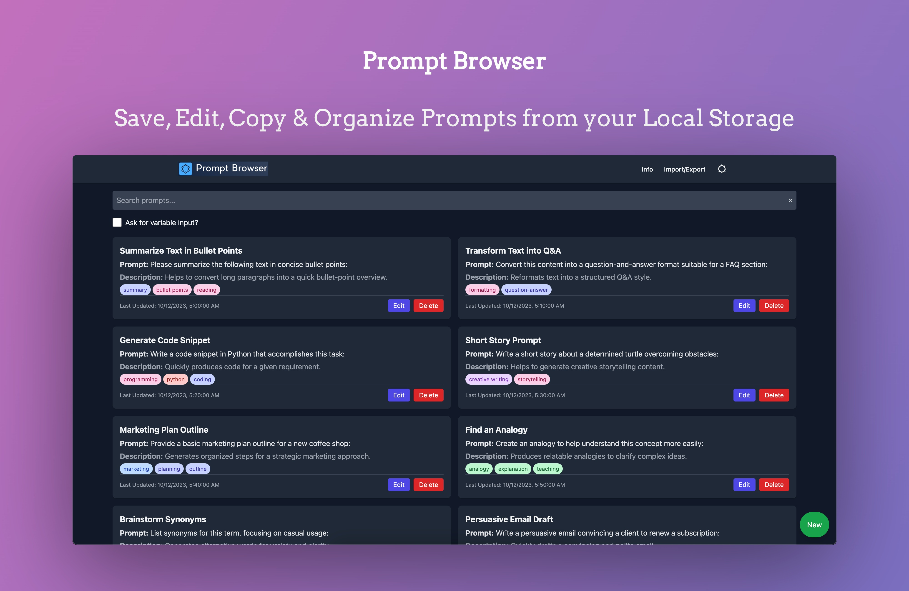

### Overview

**Prompt Browser** is a lightweight, resource-friendly application built to help users create, edit, and organize AI prompts directly in their browser’s local storage. It leverages **Tailwind CSS** for styling, minimal **JavaScript** logic for interactivity, and **Nginx** for static file serving. The entire app is bundled in a **small Docker image**, ensuring easy deployment and minimal overhead.

### Live Demo 
- Check out the [PromptBrowser](https://prompts.shawon.me) live.

### Goals and Approach

- **Simplicity & Efficiency:**  
  Designed with a focus on local data storage, Prompt Browser avoids complex back-end infrastructures, reducing resource usage and maintenance.
  
- **Fast & Minimal Setup:**  
  Deployed via a lightweight Docker container based on an Alpine Linux image running Nginx. This ensures a small footprint and quick startup times.

- **Straightforward User Experience:**  
  Users can organize prompts within their browser, add/edit/delete entries, and easily copy prompts. No account or external service is needed—everything stays local.

### Tech Stack Details

- **Static HTML, JavaScript, Tailwind CSS:**  
  Keeping the front end simple and maintaining an ultra-fast load time.
- **Nginx (Dockerized):**  
  Serves static content, providing an efficient environment.  
- **Alpine Linux Base:**  
  Ensures minimal image size and resource usage.

### Running Prompt Browser

A pre-built Docker image is hosted at [**sharfy9/PromptBrowser:latest**](https://hub.docker.com/r/sharfy9/PromptBrowser).  

#### Docker Run

```bash
docker run -d \
  -p 8080:80 \
  --name prompt-browser \
  sharfy9/PromptBrowser:latest
```

Visit http://localhost:8080 to access the app.

#### Docker Compose
```yaml
version: '3.8'
services:
  prompt-browser:
    image: sharfy9/PromptBrowser:latest
    container_name: prompt-browser
    ports:
      - "8080:80"
    restart: unless-stopped
```
Run with:

```bash
docker-compose up -d
```

Once running, open http://localhost:8080.

### Key Functionalities
- **Local Storage Management:** All prompt data is saved within the browser, eliminating reliance on external databases or APIs.
- **User-Friendly Editing & Copying:** Users can add and edit prompts with a clean UI, then copy them quickly.
- **Minimal Design & Deployment:** A single Docker container hosts the entire app, simplifying installation and updates.

### Conclusion
Prompt Browser showcases how a simple, static web project can provide efficient AI prompt management without a heavy back-end or complicated infrastructure. Its lightweight nature, combined with a minimal Docker footprint, exemplifies a clean approach to solving a common organizational challenge in AI prompt workflows.
